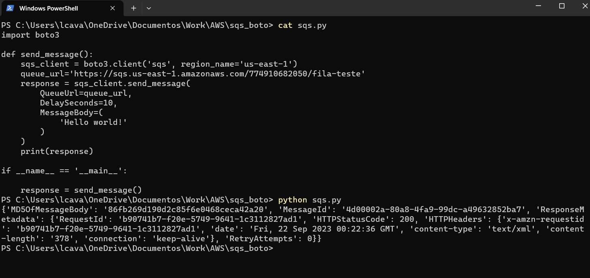
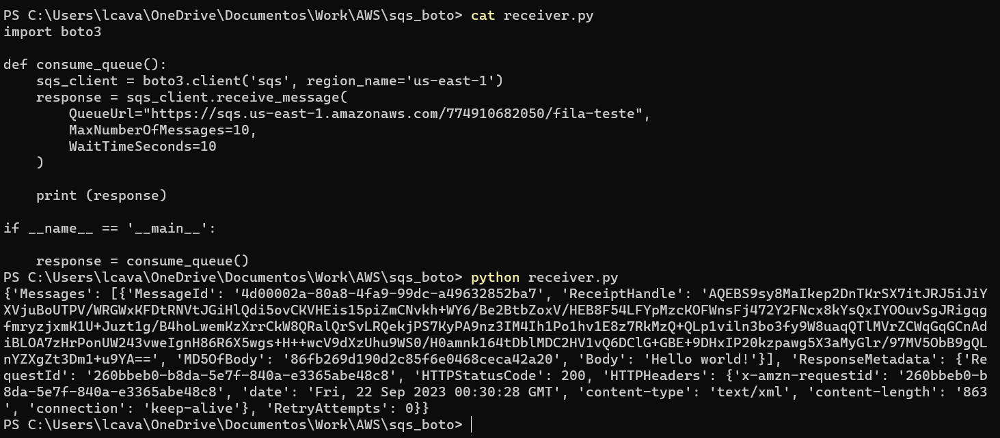
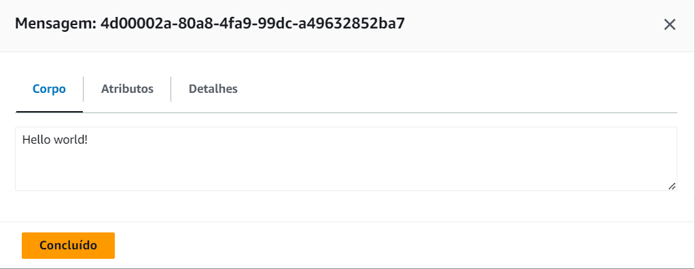

# AWS SQS BOTO
* Scrip desenvolvido em Python e boto3 responsável por enviar mensagens através do serviço SQS da AWS.
* A fila foi criada com o SQS e, tendo um usuário IAM com permissão de enviar e ereceber mensagens, foi passada a acess key e a secrete acess key desse usuário no awscli após rodar um "aws configure"

 

 

* Mensagem gerada no console:

